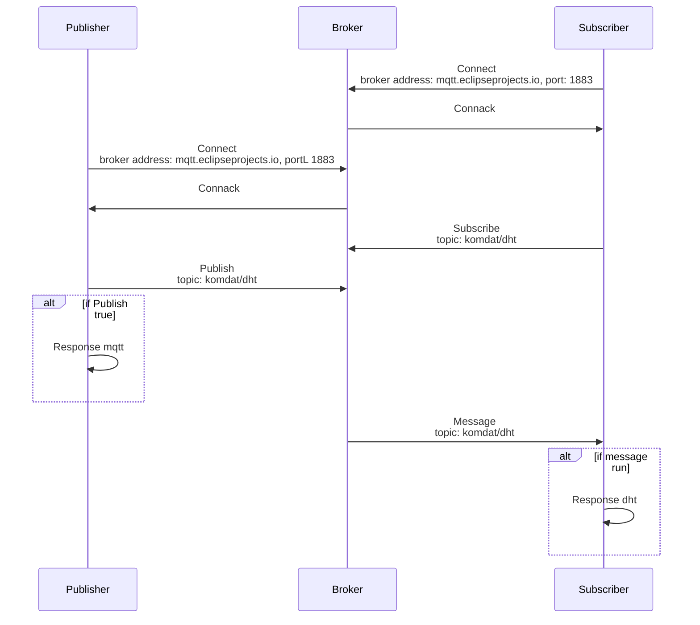

# DHT MQTT

## Device

- Raspberry Pi 4 Model B
- DHT11

## Communication

- MQTT

## Config Files

.env

#### BROKER="mqtt.eclipseprojects.io"

#### PORT=1883

#### TOPIC="komdat/dht"

## How it works?

## Format Response mqtt

Response(status=StatusResponse.response, message=str)

## Format Response dht

Response(status=StatusResponse.response, message=str), DhtResult(humidity=lemb, temp=suhu)

## Example Format Response

#### MQTT

- Response(status=StatusResponse.success, message="Message Published.")

#### DHT

- (Response(status=<StatusResponse.success: 0>, message='success'), DhtResult(humidity=56.0, temp=26.0))

## Contributors

- @mikoaf (mikoalfandi2801@gmail.com)
